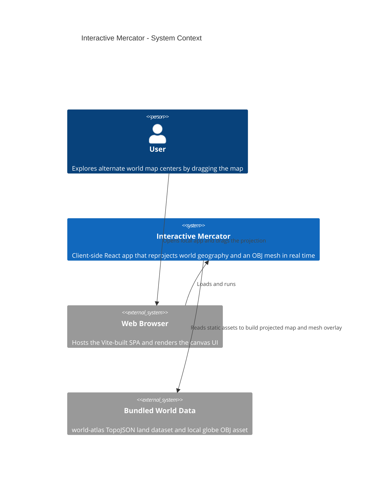

# Architecture

## System Context

## High-Level Overview

- Purpose: Interactive demo that lets users drag the world center and compare Mercator and orthographic projections in real time. Evidence: `README.md`, `src/App.tsx`.
- Languages and versions: TypeScript on ES2022, JSX with React 18. Evidence: `package.json`, `tsconfig.json`.
- Frameworks and libraries: React for UI, Vite for dev/build, d3-geo for projections and path rendering, three.js OBJLoader for mesh import, topojson-client with world-atlas for land geometry, Vitest for tests.
- Package manager and dependency files: npm with `package.json`; TypeScript compiler settings in `tsconfig.json`; Vite config in `vite.config.ts`.
- Persistence layer: None.
- Local runtime: Only Node.js and npm are needed. Devs run `npm install` and `npm run dev`.

## Style

- Client-side single-page application.
- No backend or distributed components. All projection math, rendering, and interaction stay in the browser.

## Component Interaction

- App startup mounts `App`, then `ResizeObserver` tracks the map stage size and stores the current viewport.
- `App` loads TopoJSON land data synchronously from the bundle and loads the OBJ mesh asynchronously through `loadGlobeMesh`.
- Pointer drag events update the map center through `centerFromDrag`, which converts pixel deltas into longitude and latitude deltas with projection-specific latitude clamps.
- Any change to center, viewport, projection kind, or mesh triangles triggers `drawScene`, which rebuilds the active d3 projection and repaints the entire canvas.
- Orthographic mode adds visible-hemisphere filtering for mesh triangles before drawing, while Mercator draws the full unwrapped world.

